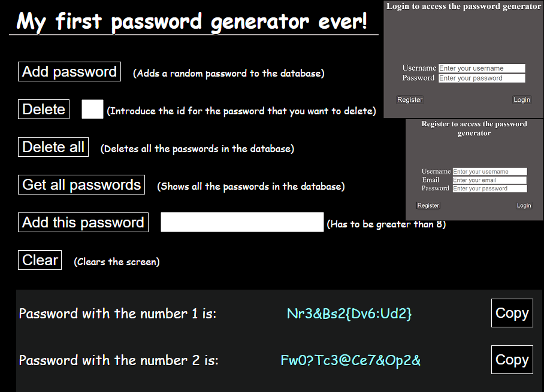

# password-generator-and-storage

# About
This is going to be my first project and I am really happy to be working on it. As the title suggests this application is generating a random password and it stores it in a database.

 
(I still have to decide how to design the application, so I am sorry if this looks bad at this moment)
<!--  
(Sorry for the general aspect of this one as well) THIS SHOULD BE A PLACE FOR THE FUTURE IMAGE OF THE LOGIN FORM-->

# Built with 
- Java Spring Boot
- HTML
- CSS
- JavaScript
- PostgreSQL (for storing)

# Objectives
_My_ goal is to create my first project and to be able to manage and work on it (by improving it as much as possible).

The project's objectives are:
1. Being able to generate and store strong passwords safely in a database.
2. To secure the passwords by adding a login form.
3. To make the user interaction a nice experience.
4. Improve every time I find something that can be improved.

# Improvements over time
* A little bit of the aspect (about border and colors)
* More user-friendly environment (when you add or remove a password it would automatically show the change)
* Added the method to be able to add your own password
* Added some tests for the REST API
  - for the password class
  - for the repository
  - for the service layer
  - for the controller
* Added the button that copies the password to clipboard
  - with a color transition when it is clicked

# How the application works
The <b>login</b> form is not completed yet, but that is going to be the first thing that the user will see. If the user doesn't have an account he will be able to click on a link that will send him / her to a <b>register</b> form. After an account is created and the login process is done, the user will be able to access the <b>password generator and storage</b> application. The design of it is quite simple, since this is my first project, but as I said before I will try to improve as much as I can. There are some buttons on the screen and in the right side of each button there is an explanation about what it does. I will add a message that will show if there are no passwords in the database, so the user has a general idea about how it works.
 - <b>Clicking on a button</b> will trigger an increase in size and change of color of the right text (so the user knows that that button was clicked). After the button is clicked a change will appear on the screen (if <b>”Add password”</b> is clicked, it will generate a <b>random password, add it to the database and show the change on the screen</b>)
 - The usage of each button is pretty straightforward since it has an explanation on the screen
 - The user <b>can add one of his / hers own password</b> by writing it in the specific box and clicking on the <b>”Add this password”</b> button
 - There are the delete options: by id (there will be a number in front of each password which represents its id) and by deleting all the passwords
 - When the passwords are shown, there are buttons in the right side of each one that if clicked will <b>copy</b> that password to clipboard

# Why web application
I actually thought about a GUI program, but in the past I've worked a little bit with web development (only front-end) and I really enjoyed it. The problem was that I had no experience with back-end and no idea where to start. Then at university I was introduced to Java. I liked every aspect about it and I learned it quite fast (since I already knew C and C++ to some degree). That was when I realized that I want to know more about Java. After learning other aspects that I didn't know about, I've decided to choose the path _web application_ with Spring Boot (since I already knew some HTLM, CSS and JavaScript) and here we are.

